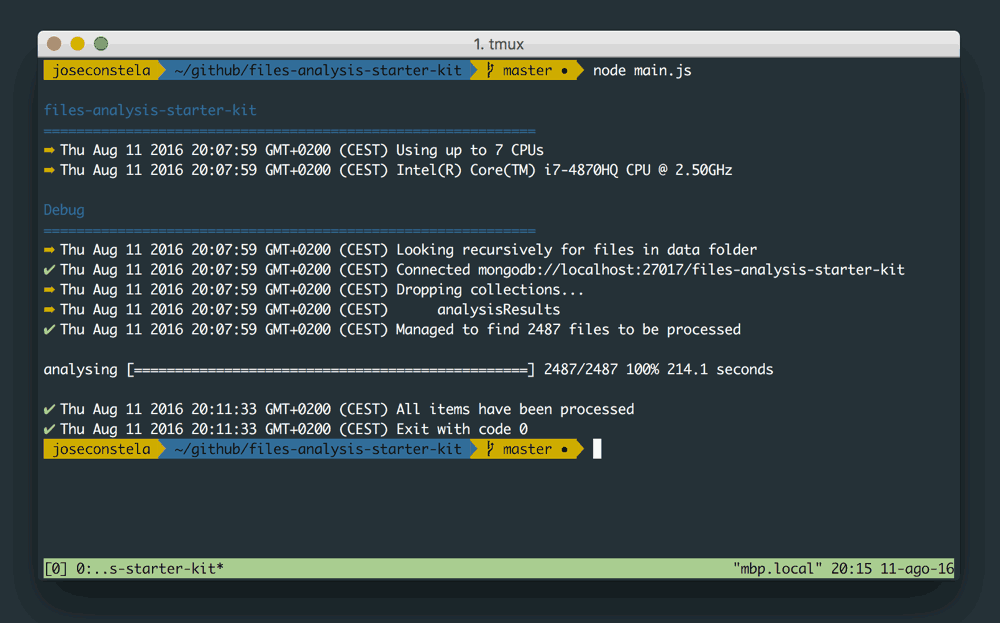

<hr>

Project for analysing large amount of files with NodeJs (& MongoDb).



This NodeJs application searches for all files within an specific folder - recursively - and sends each file info to your processing library. It takes care of multithreading, queuing and managing database connections.

## Usage

1. Edit the [```libs/analysis.js```](libs/analysis.js) process function to use your processing library/code. See the examples folder.

```
Usage: main.js --cpus [num] --path [string]

Options:
  -c, --cpus     Max number of CPUs to use                                 [number] [required] [default: 1]
  -p, --path     Files location                                       [string] [required] [default: "data"]
  -m, --mongodb  Mongo url                  [string] [required] [default: "mongodb://localhost:27017/fask"]
  -h, --help     Show help                                                                        [boolean]

Examples:
  main.js -c 4 -p data/  Uses up to 4 CPUs to analyse files wihtin the data
                         folder and connects mongodb to its default host.
```

## The processing

The actual analysis code must be placed within ```libs/analysis.js``` process function.

```
/**
 * Runs the analysis
 * @param  {Object}   dbs      Contains the DB instances
 * @param  {Object}   fileInfo Contains the file information
 * @param  {Function} callback Callback
 */
module.exports.process = (dbs, fileInfo, callback) => {
  require('your-analysis-library').process(dbs, fileInfo, callback)
}
```

The fileInfo parameter have the following structure:

```
{
  root: '/',
  dir: '/.../files-analysis-starter-kit/data/subfolder',
  base: 'myPdfFile.PDF',
  ext: '.PDF',
  name: 'myPdfFile',
  route: '/.../files-analysis-starter-kit/data/subfolder/myPdfFile.PDF',
  mime: 'application/pdf',
  stats: {
    dev: 16777220,
    mode: 33188,
    nlink: 1,
    uid: 501, // user-id of the owner of the file.
    gid: 20, // group-id of the owner of the file.
    rdev: 0,
    blksize: 4096,
    ino: 29670994,
    size: 68704, // Size in bytes
    blocks: 136,
    atime: Thu Aug 11 2016 13:30:51 GMT+0200 (CEST), // last access
    mtime: Tue Apr 01 2008 08:52:56 GMT+0200 (CEST), // last modification
    ctime: Tue Aug 09 2016 04:20:35 GMT+0200 (CEST), // creation
    birthtime: Tue Apr 01 2008 08:52:56 GMT+0200 (CEST)
  }
}
```

To use the MongoDb connection use ```dbs.mongo```. i.e.:

```
dbs.mongo.getCollection('myCollection').insert(...)
```
